title: Firefox OS
author:
  name: "Les Orchard"
  twitter: "@lmorchard"
  url: "http://lmorchard.com/"
style: index.css
output: index.html
controls: true

--

# Firefox OS
## A look at Mozilla's OS for the Open Web

--

### Who am I?

Hi there.

<pre>
les orchard
me@lmorchard.com

{web,mad,computer} scientist;
{tech,scifi} writer;
home{brew,roast}er;
mozillian
</pre>

--

### What is Firefox OS?

Mozilla's open source OS for the Open Web

--

### First, there was Boot2Gecko

[Announced in July 2011.](https://groups.google.com/forum/#!topic/mozilla.dev.platform/dmip1GpD5II[1-25-false])

Have you ever wanted to boot straight into Emacs?

We built a Linux distro that boots into Gecko, the engine that powers Firefox.

--

### Gonk, Gecko, and Gaia

There's more to an OS than just a browser.

* **Gonk** - Linux kernel and HAL

* **Gecko** - Web run-time engine from Firefox

* **Gaia** - User interface, written in HTML / CSS / JS

--

### Gonk, Gecko, and Gaia

--

### Gonk, Gecko, and Gaia

Gonk is a very small Linux distro that borrows from the
[Android Open Source Project](http://source.android.com/)

* Shares Android drivers and low-level dev tools

* Runs on similar hardware as Android

* Does *not* run Android apps

--

### Gonk, Gecko, and Gaia

<section style="overflow: hidden; display: block; height: 80%; background: url(img/os-parts.png) transparent no-repeat; background-position: center -500px">
</section>

--

### Gonk, Gecko, and Gaia

Gecko is the core of Firefox stripped down to a runtime.

* The `b2g` executable launched by Gonk.

* Renders HTML & CSS, executes JavaScript.

* Provides [WebAPIs](https://developer.mozilla.org/en-US/docs/WebAPI)
  through which JavaScript can access Gonk services.

--

### Gonk, Gecko, and Gaia

<section style="overflow: hidden; display: block; height: 80%; background: url(img/os-parts.png) transparent no-repeat; background-position: center -200px">
</section>

--

### Gonk, Gecko, and Gaia

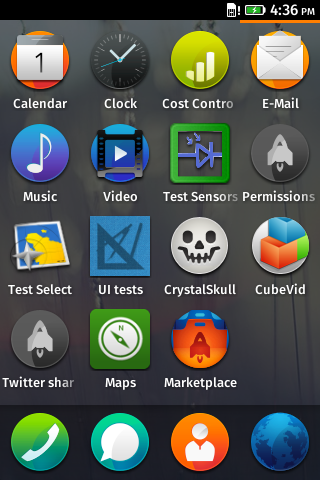

<section style="margin-right: 35%">

Gaia is the ground-floor UI.

* Home screen & status bar

* App management

* Built-in apps - Browser, Mail, Calendar, Phone, SMS, etc

* Written in HTML, CSS, & JS

</section>

--

### Gonk, Gecko, and Gaia

<section style="overflow: hidden; display: block; height: 80%; background: url(img/os-parts.png) transparent no-repeat; background-position: center 0px">
</section>

--

### RED PANDA BREAK!

*Did you know?* Firefox was named for [the Red Panda](http://en.wikipedia.org/wiki/Red_panda).

--

### Open Web Apps

Basically, an Open Web App is a web page.

But, web pages aren't (just) what they used to be.

[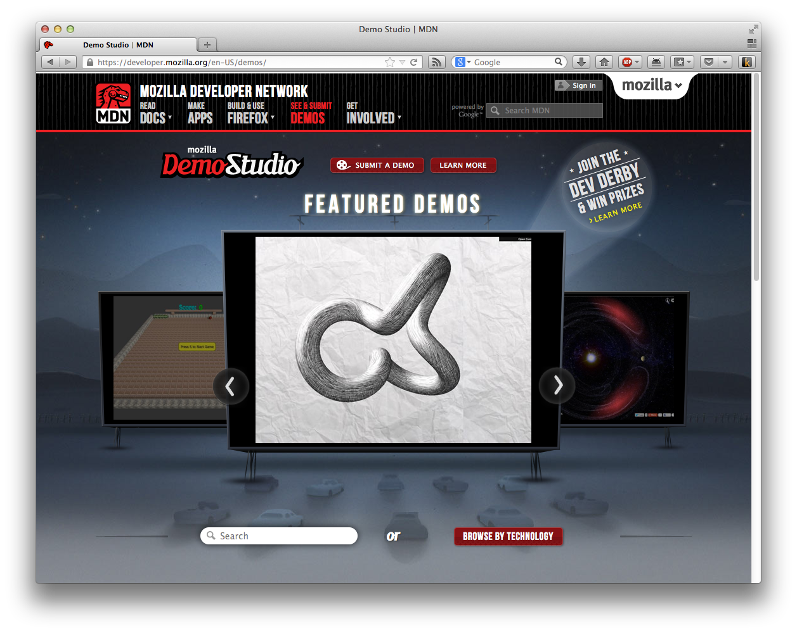](https://developer.mozilla.org/en-US/demos/)

--

### Open Web Apps

HTML5 introduces new APIs for media, storage, geolocation, offline
access, etc.

Additional [WebAPIs](https://developer.mozilla.org/en-US/docs/WebAPI) proposed as public standards.

--

### Web is the New Native

**Everything** on Firefox OS is an Open Web App

Write once, run <strike class="dim">everywhere</strike> in lots of places

If you really, really need to compile C code - consider
  [asm.js](http://asmjs.org/) and
  [emscripten](https://github.com/kripken/emscripten/wiki)

--

### Web is the New Native

The Web is faster than you might think, these days.

[They ported Unreal Engine 3 to the Web in 4 days.](http://www.unrealengine.com/html5/)

--

### Developing Apps

So, Firefox OS apps are "just" web pages.

Use whatever JavaScript framework you'd like

Adapt your current site to work better with...

* Small, medium, & large displays

* Mouse, keyboard, & touch input schemes

--

### Developing Apps

So, Firefox OS apps are "just" web pages.

Also, [the Firefox OS Simulator add-on](https://addons.mozilla.org/en-US/firefox/addon/firefox-os-simulator/?src=search) is handy.

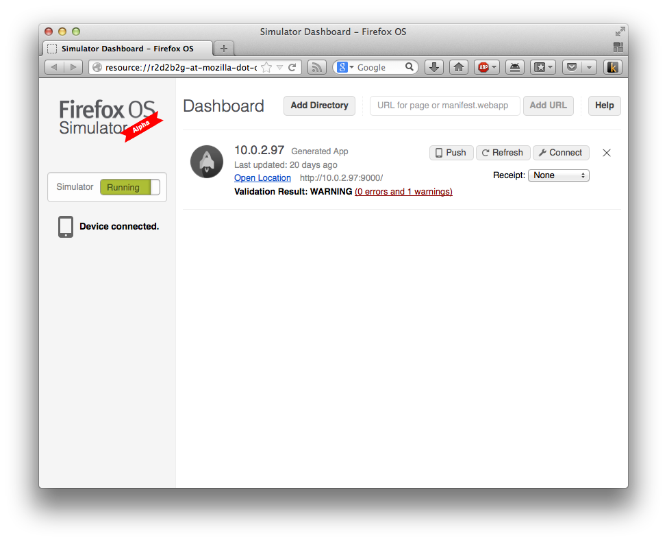
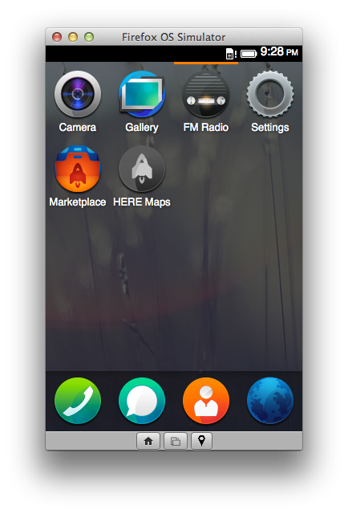

--

### Developing Apps

So, Firefox OS apps are "just" web pages.

Also, it's nice to have [an example to start](https://hacks.mozilla.org/2013/01/introducing-the-firefox-os-boilerplate-app/).

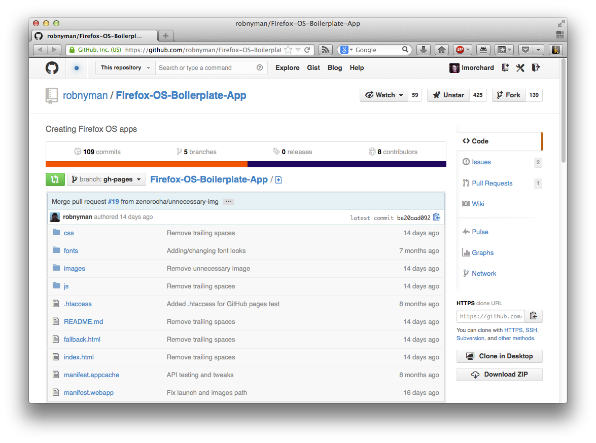
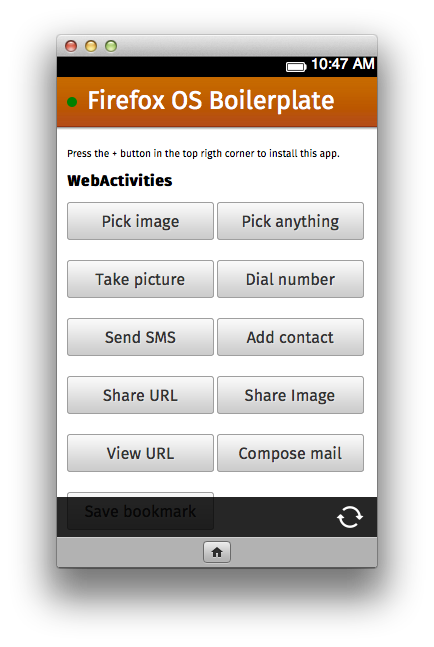

--

### Developing Apps

So, Firefox OS apps are "just" web pages.

Also, it's nice to have [some building blocks](http://buildingfirefoxos.com).

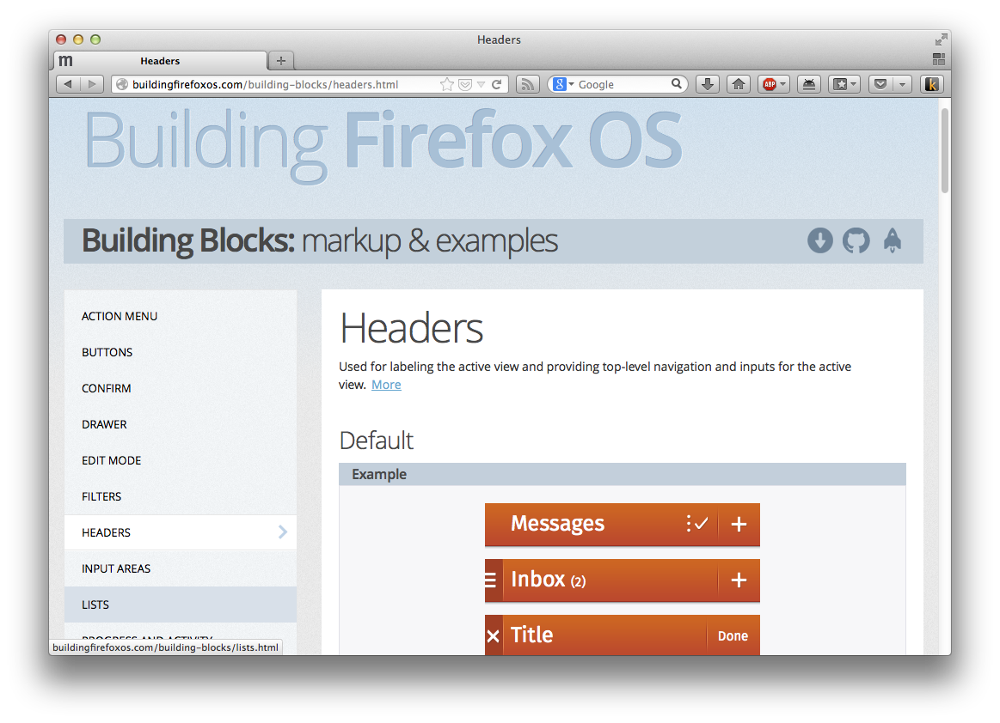

--

### Publishing Apps

App stores are [the new search engines](https://marketplace.firefox.com). 
(Kinda)

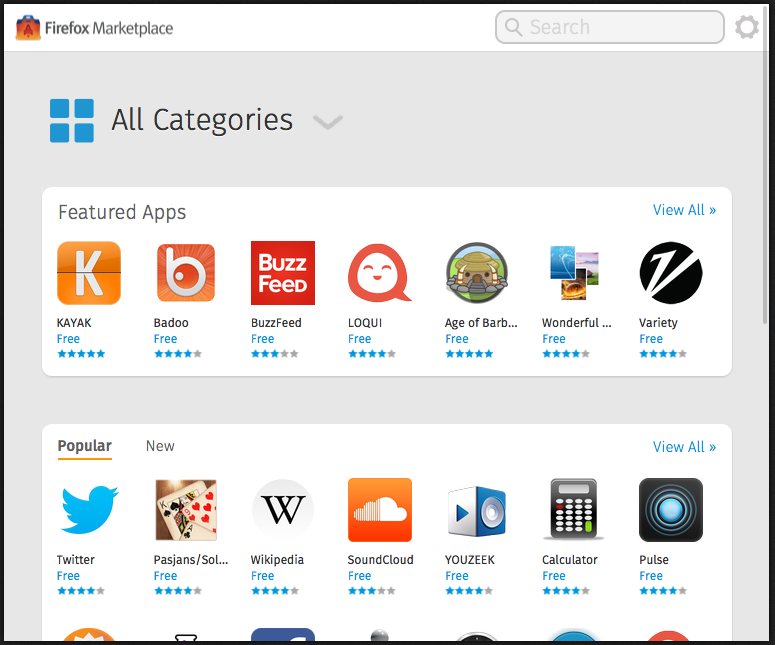

--

### Publishing Apps

Firefox Marketplace implements the [Open Web Apps](https://developer.mozilla.org/en-US/docs/Web/Apps) publishing scheme:

* [A JSON manifest for describing an App](https://developer.mozilla.org/en-US/docs/Web/Apps/Manifest)

* [JavaScript APIs for installing & managing Apps](https://developer.mozilla.org/en-US/docs/Web/Apps/JavaScript_API)

*TL;DR: You can run your own "marketplace", even if it's just a page with
install buttons for your own apps.*

--

### Publishing Apps

Sample `manifest.webapp`:

<pre style="font-size: 0.5em; line-height: 1.25em; margin-top: -2em">
{
    "version": "0.1",
    "name": "Area Tweet",
    "description": "Find tweets by for any location",
    "icons": {
        "48": "http://areatweet.com/images/icon-48.png",
        "128": "http://areatweet.com/images/icon-128.png"
    },
    "developer": {
        "name": "David Walsh",
        "url": "http://areatweet.com"
    },
    "installs_allowed_from": [
        "http://areatweet.com",
        "https://marketplace.firefox.com"
    ],
    "default_locale": "en" 
}
</pre>

--

### Publishing Apps

Sample App installation code:

<pre style="font-size: 0.6em; line-height: 1.25em; margin-top: -0.5em">
var MANIFEST_URL ='https://myapp.example.com/manifest.webapp';
var installApp = navigator.mozApps.install(MANIFEST_URL);
 
// Successful install
installApp.onsuccess = function(data) {
    console.log("Success, app installed!");
};
 
// Install failed
installApp.onerror = function() {
    console.log("Install failed\n\n:" + installApp.error.name);
};
</pre>

--

### Publishing Apps

Open Web Apps can also be installed via Firefox for Android and
Desktop (Nightly, for now)

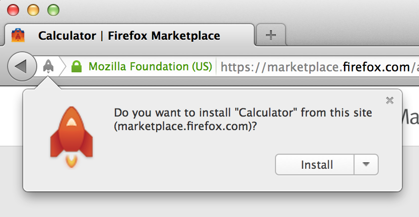
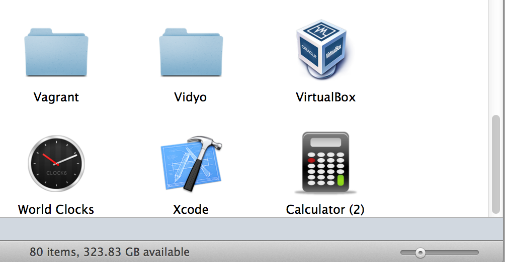

--

### Publishing Apps

Open Web Apps can also be installed via Firefox for Android and
Desktop (Nightly, for now)

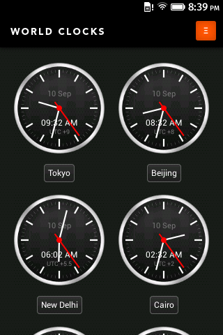
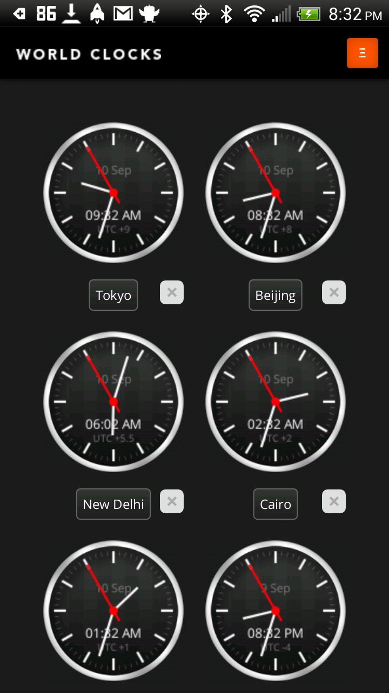
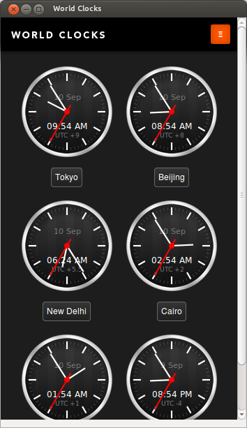
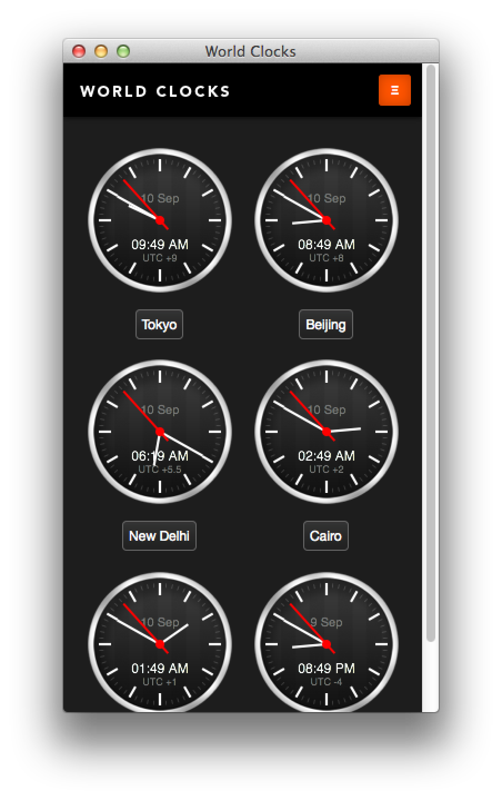

--

### Available Devices

[Geeksphone Keon & Peak](http://www.geeksphone.com/#slider-peak)

[First public Firefox OS developer preview devices](https://hacks.mozilla.org/2013/01/announcing-the-firefox-os-developer-preview-phone/)

--

### Available Devices

[ZTE Open](https://fxosphone.mozilla.com.tw/zteopen/), [sold by ZTE on eBay](http://stores.ebay.com/ztemobileus)

[From Telefonica in Spain and Latin America](https://blog.mozilla.org/blog/2013/08/01/telefonica-announces-launches-of-first-firefox-os-devices-in-latin-america/)

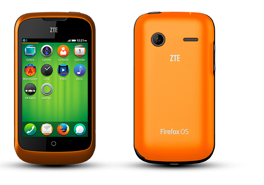

--

### Available Devices

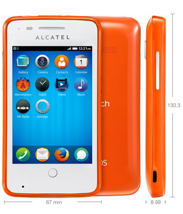

[Alcatel One Touch Fire](http://www.alcatelonetouch.com/global-en/products/smartphones/one_touch_fire.html#.Ui91sLzXHmF)

[From Telefonica in Spain and Latin America](https://blog.mozilla.org/blog/2013/08/01/telefonica-announces-launches-of-first-firefox-os-devices-in-latin-america/)

[From Deutsche Telekom in Poland](https://blog.mozilla.org/blog/2013/07/11/deutsche-telekom-announces-european-launch-of-firefox-os-devices/)

--

### The End (also: FENNEC BREAK!)

*Did you know?* Firefox for Mobile was codenamed "Fennec" for [the desert fox](http://en.wikipedia.org/wiki/Fennec_fox).

